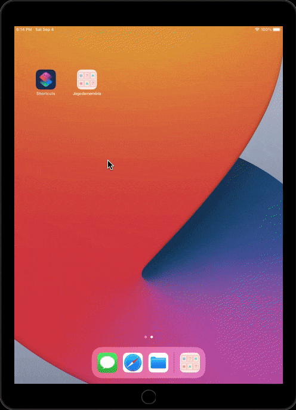
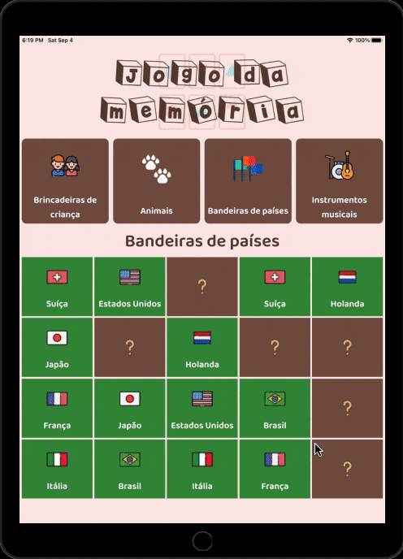
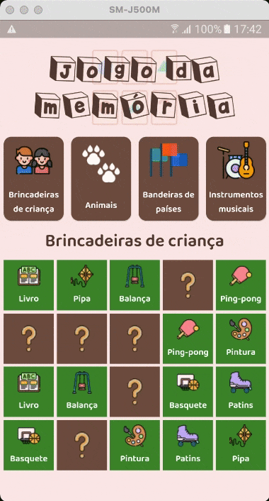
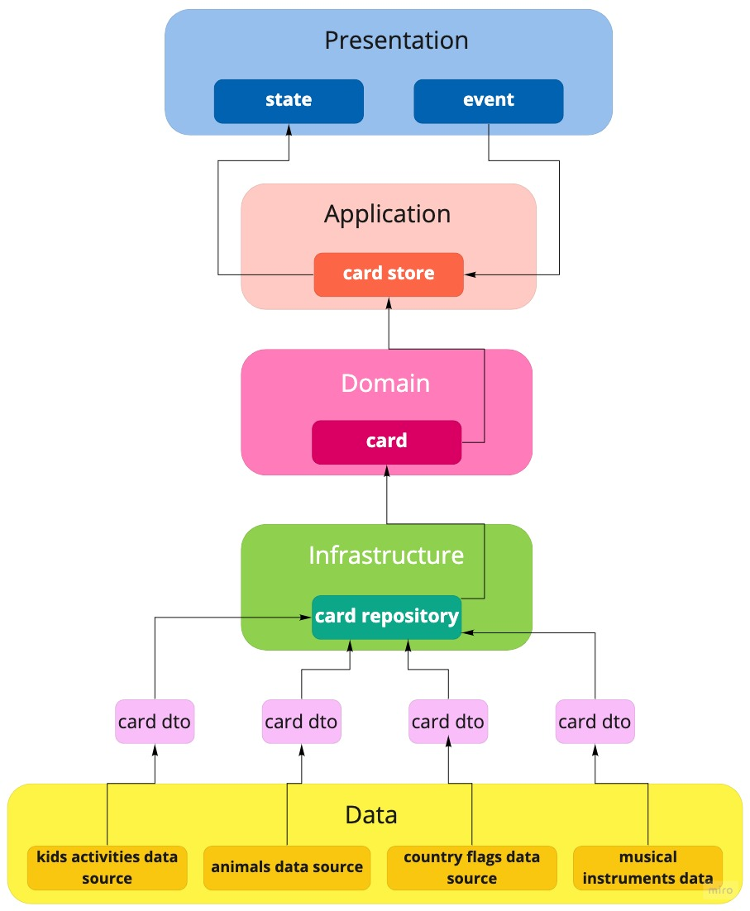

# Jogo da memória desenvolvido em Flutter

## Tecnologias/bibliotecas

Algumas das tecnologias/bibliotecas utilizadas na construção do aplicativo foram:

 - Flutter toolkit 2.2.3 (stable)
 - Dart 2.13.4 (null safety)
 - flutter_modular 3.2.2+1
 - flutter_triple: 1.2.4+3
 - flutter_screenutil 5.0.0+2
 - lottie 1.1.0
 - soundpool 2.1.0
 - dart_code_metrics 4.1.0
 - lint 1.5.3
 - mocktail 0.1.4
 - flutter_launcher_icons 0.9.2
 - flutter_native_splash 1.2.1

Além dessas, há também outras bibliotecas. O pubspec.yaml possui a lista completa das bibliotecas utilizadas.

## O Jogo

Este jogo da memória é bem simples. Cada partida possui um conjunto de 20 cartas não identificáveis, posicionadas em 5 colunas e 4 linhas, sendo 10 cartas diferentes, cada uma com seu respectivo clone. 

Ao virar uma carta de uma posição qualquer, o jogador deve descobrir ou lembrar em qual posição está localizado o seu par. Caso acerte, ambas as cartas ficam visíveis para o restante do jogo. Caso contrário, ambas as cartas voltam a ter suas identificações ocultadas, continuando disponíveis para que seu par seja encontrado.

O jogo termina quando todas as cartas tiverem seus pares descobertos.

### Tipos de cartas

Atualmente o jogo possui 4 tipos de cartas:
 - Brincadeiras de criança
 - Animais
 - Bandeiras de países
 - Instrumentos musicais

### Telas

Troca dos tipos de cartas no emulador iPhone 12 max.


Iniciando e finalizando o jogo no emulador iPad geração 8.

<p float="left">
  
  
</p>

Iniciando e finalizando o jogo no iPhone 5.

<p float="left">
  
  
</p>

Iniciando e finalzando o jogo no iPhone 8.

<p float="left">
  
  
</p>

Iniciando e finalizando o jogo no android J5.

<p float="left">


</p>

## O desenvolvimento

O jogo em si é bem simples. No entanto, o principal ponto desse projeto é como a sua arquitetura foi projetada, pensando, sobretudo, na escalabilidade.

### Arquitetura

A figura abaixo mostra como foi desenhada a arquitetura do jogo.



### SOLID

Primeiramente, é quase impossível iniciar essa discussão sem mencionar os princípios do [SOLID](https://blog.cleancoder.com/uncle-bob/2020/10/18/Solid-Relevance.html) e de [arquitetura limpa](https://blog.cleancoder.com/uncle-bob/2012/08/13/the-clean-architecture.html). Cada passo nesse projeto foi pensado com a finalidade de atender cada princípio.

Obviamente, como não é uma aplicação complexa, princípios como a <b> segregação de interface (Interface Segregation Principle, o I do SOLID) </b> foi aplicada pela própria natureza do projeto. 

#### Princípio da inversão de dependência (Dependency Inversion Principle - DIP)

No entanto, o enfoque será em como o princípio da inversão de dependência possibilitou a escalabilidade desse projeto.

Como o projeto é somente um jogo de memória e não uma plataforma de jogos diversos (quem sabe futuramente possa vir a ser), a sua escalabilidade está voltada na disponibilidade dos tipos de cartas para o jogo. Como mencionado anteriormente, o jogo dispõe de 4 tipos de cartas.

É exatamente nesse ponto que é necessário ressaltar o DIP.

Analisando a figura da arquitetura do projeto, é possível visualizar a camada Data. É nessa camada onde os tipos de cartas do jogo estão armazenados. Cada tipo é retornado para o repositório usando uma classe intermediária chamada <b>CardDto</b>.

E como o repositório acessa cada tipo de carta? Usando condicionais <i>ifs</i>? Usando o <i>switch/case</i>? A resposta para ambas as perguntas é <b>NÃO</b>.

O acesso é realizado usando a inversão de dependência. O código abaixo mostra como a classe <b>CardRepository</b> é criada.

```dart
class CardRepository implements ICardRepository {
  final CardDataSource cardDataSource;

  const CardRepository({
    required this.cardDataSource,
  });
}
```

<b>CardDataSource</b> é uma classe abstrata, ou seja, CardRepository depende de uma abstração e não de uma implementação, exatamente como descrito no DIP.

#### Injeção de dependência

Nesse caso, como o tipo de carta de interesse será passado para o CardRepository? 

Antes da resposta, é necessário um entendimento prévio do desenvolvimento. Cada tipo de carta é uma classe. Por exemplo, a carta de bandeiras de paises:

```dart

class CountryFlagsDataSource implements CardDataSource {
  @override
  List<CardDto> create() {
    const imageBasePath = 'assets/images/country_flags';

    return [
      CardDto(
        name: 'Brasil',
        image: '$imageBasePath/brazil.png',
        selectedToGame: 0,
      ),
      CardDto(
        name: 'Inglaterra',
        image: '$imageBasePath/england.png',
        selectedToGame: 0,
      ),
      .
      .

```

A classe <b>CountryFlagsDataSource</b>, através do método <b>create</b>, retorna uma lista de CardDto, onde cada um contém os dados relacionados a bandeira de um determinado país.

É possível perceber, na declaração da classe, que CountryFlagsDataSource é uma implementação da classe abstrata CardDataSource. Em resumo, uma variável do tipo CardDataSource é compatível com a instância de CountryFlagsDataSource.

Com esse conhecimento e respondendo a pergunta feita anteriormente, CardRepository receberá o tipo da carta de interesse através do uso do <i>design pattern</i> injeção de dependência.

A classe concreta CountryFlagsDataSource é <b>injetada</b> no construtor de CardRepository. Ou seja, <b>this.cardDataSource</b>, que é do tipo CardDataSource, receberá a instância da classe concreta CountryFlagsDataSource. Para utilizar um outro tipo de carta no jogo como, por exemplo, o tipo de animais, basta simplesmente injetar a classe <b>AnimalsDataSource</b>.

Caso seja necessário um novo tipo de carta para o jogo, como, por exemplo, o tipo frutas, basta criar uma classe chamada <b>FruitsDataSource</b>, com a lista de frutas e injetar essa classe em CardRepository.

Em que momento é realizada a injeção dessas classes concretas? Essa injeção é realizada no momento em que a classe CardRepository é instanciada. Essa injeção pode ser realizada por uma implementação própria do desenvolvedor, ou usando alguns pacotes como o [flutter modular](https://pub.dev/packages/flutter_modular), o [riverpod](https://pub.dev/packages/riverpod), o [injectable](https://pub.dev/packages/injectable), entre outros, que facilitam esse processo.

#### Flutter modular

Nesse projeto a escolha foi pelo flutter modular. E o motivo é bem simples. Além da injeção de dependência, o flutter modular também realiza o gerenciamento de rotas.

Para cada tipo de carta escolhida, o aplicativo recarrega a mesma rota, porém passando como parâmetro a instância da respectiva classe. O flutter modular consegue realizar a injeção com a instância da classe recebida do parâmetro, facilitando demais o trabalho.

Além disso, ao recarregar a mesma rota, o flutter modular automaticamente realiza a limpeza (<i>dispose</i>) dos dados antigos da memória, permitindo que o aplicativo receba os novos dados sem conflito algum.

#### Considerações

Os princípios do SOLID estão ligados entre si. A solução descrita anteriormente também se aplica ao Open-Closed Principle (o O do SOLID), ou seja, não há necessidade alguma de alterar uma linha de código sequer em CardRepository para estender o jogo com um novo tipo de carta. Resumindo, o código está fechado para modificação e aberto para extensão.

Este é um exemplo didático de como o princípio da inversão de dependência facilitou o processo para disponibilizar diferentes cartas no jogo. Claro que em um universo mais complexo, com 100 diferentes tipos de cartas, criar uma classe para cada tipo torna-se inconveniente. Nesse caso, talvez seja necessário uma solução mais elaborada, como uma api, por exemplo, para armazenar e fornecer diferentes tipos de cartas. No entanto, no final das contas, a implementação de CardRepository não será diferente do proposto.

## Imagens das cartas do jogo

<div>Icons made by <a href="https://www.freepik.com" title="Freepik">Freepik</a> from <a href="https://www.flaticon.com/" title="Flaticon">www.flaticon.com</a></div>

## Animação de comemoração de fim de jogo 

<https://lottiefiles.com>

## Efeito sonoro de comemoração de fim de jogo

<https://www.videvo.net/sound-effect/concert-crowd-huge-cr-pe609502/240283/>
